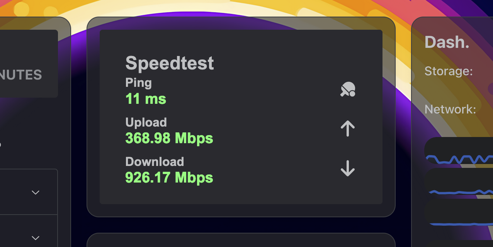

# Myspeed Dashboard Widget

This project creates a widget that displays network performance metrics (Ping, Download, Upload) based on data from a **Myspeed** instance. You can choose between two display formats: **Large** or **Medium**.

 

---

## Prerequisites

1. **Myspeed** must be installed and accessible. You need the API URL (e.g., `http://URL/api/speedtests?hours=24`).
2. **Docker** must be installed on your system. [Docker Installation Guide](https://docs.docker.com/get-docker/).

---

## Installation

1. Clone this repository to your local machine:
   ```bash
   git clone https://github.com/cedev-1/Widget-Homarr-MySpeed
   cd Widget-Homarr-MySpeed
    ```

2. Build the Docker image using the Dockerfile:
    ```bash
    docker build -t myspeed-widget .
    ```

## Configuration

Before starting the project, you need to configure the following:

    API URL for Myspeed
    Edit the app.py file to specify your Myspeed API URL:
    url = "http://<MYSPEED_IP>:5216/api/speedtests?hours=24"

Choose Display Format
By default, the app.py file uses large.html. You can switch to medium.html by editing the template rendering

## Running the Project

Start the Docker container:
    
    docker run -d -p 8765:8765 myspeed-widget

Open your browser and navigate to:
http://localhost:8765


## Deploy

On Homarr add Ifram widget et add your url like http://localhost:8765
